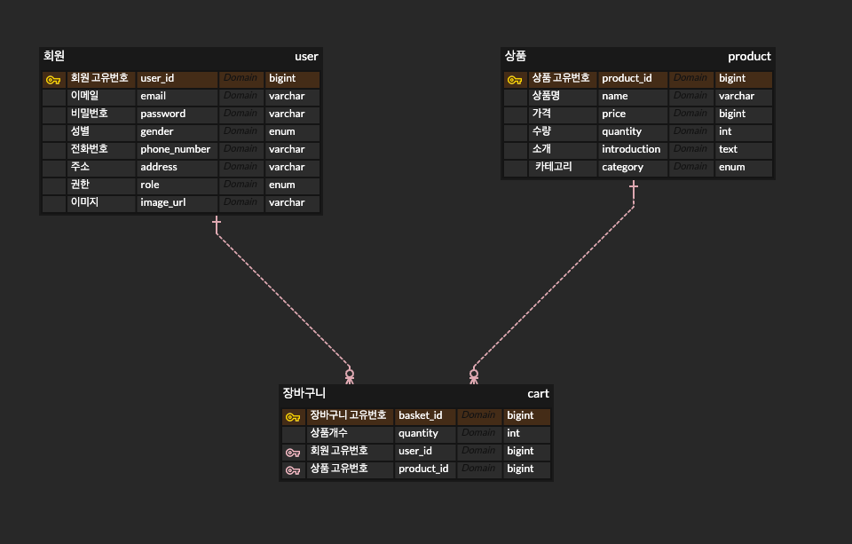
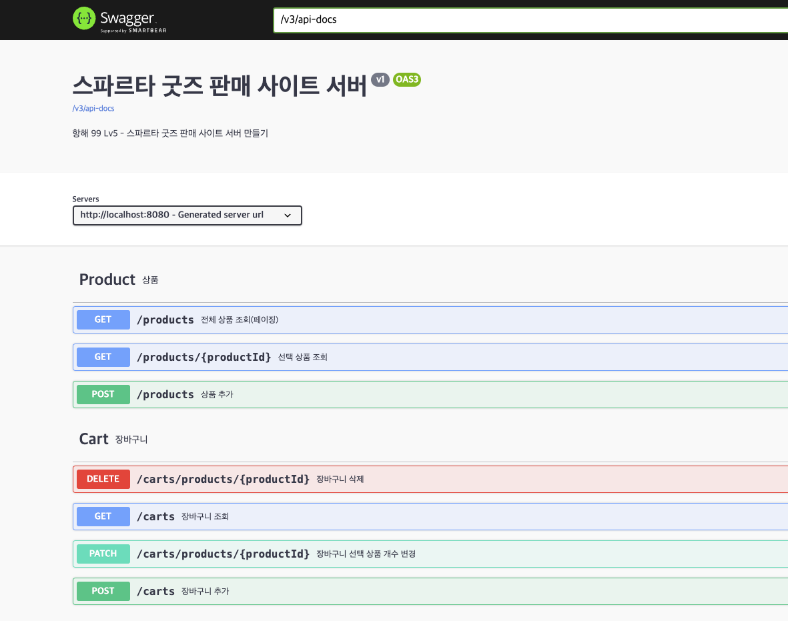

# 항해99 주특기 Lv.5 과제 - 굿즈 쇼핑몰 백엔드 REST API

## 📝 개요
- 굿즈 쇼핑몰 REST API 개발 과제입니다.
---

### 🛠️ Stack
- IntelliJ IDEA Ultimate
- Gradle
- Spring Security
- Spring boot v3.2.3
- Spring MVC
- Spring Data JPA
- Java 17

### 배포(API 경로) - http://ec2-3-34-97-251.ap-northeast-2.compute.amazonaws.com
- AWS RDS MySQL
- AWS EC2
- AWS S3 (이미지 저장)

### ERD - https://www.erdcloud.com/d/Yc6bFdnMRZHz3xfA6

### API 명세서 (Postman)
- Postman API Document 입니다.
- https://documenter.getpostman.com/view/28420346/2sA2xmUAg8

### Swagger - 구현 했지만, 접근 제한이 마땅치 않아 Swagger는 막아뒀습니다.

---

## 💡주요 기능
- 회원(ADMIN, USER)
    - [x] 회원 가입
    - [x] 회원 로그인
- 상품
    - [x] 상품 등록 - ADMIN 권한만 가능 (AWS S3 이미지 업로드)
    - [x] 선택 상품 조회 - 모든 사용자 가능
    - [x] 상품 목록 조회 / 페이징
- 장바구니
    - [x] 장바구니 추가
    - [x] 장바구니 조회
    - [x] 장바구니 수정
    - [x] 장바구니 삭제